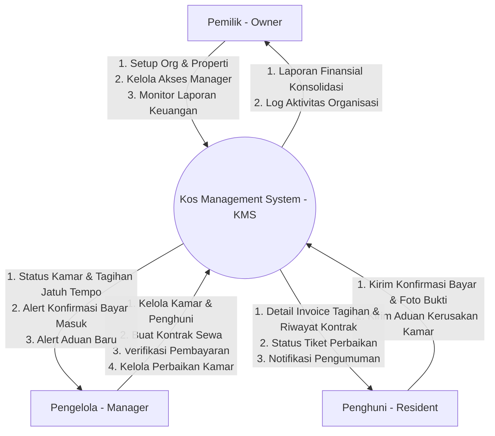
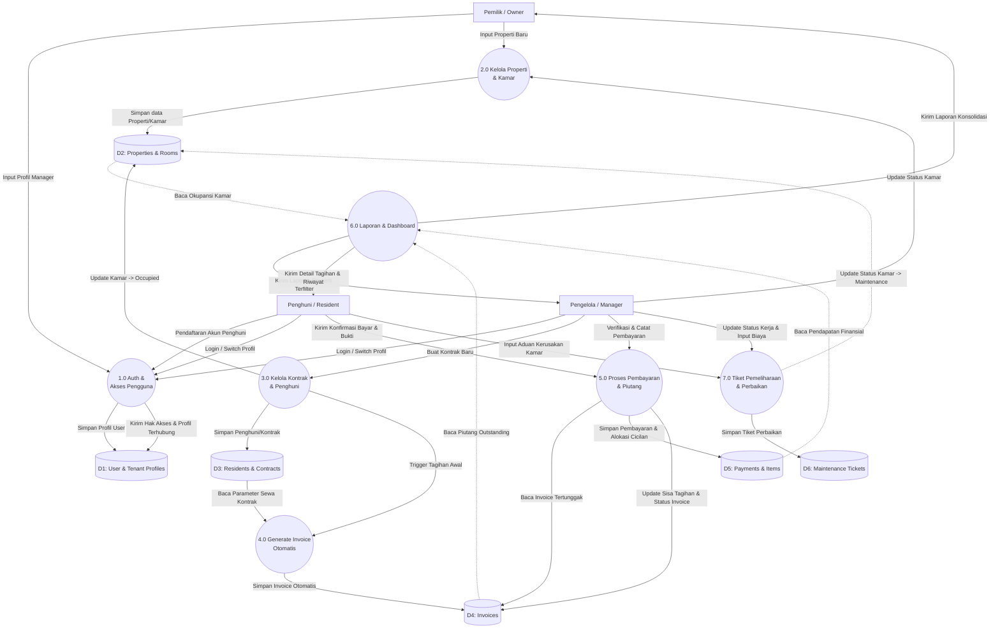

# Data Flow Diagram (DFD)
## Kos Management System (KMS)

Dokumen ini memetakan aliran data pada sistem manajemen kos (KMS) dari level konteks (Level 0) hingga diagram aliran data level 1 yang mendukung peran Pemilik, Pengelola, dan Penghuni.

---

## 1. DFD Level 0 (Context Diagram)

Context diagram menunjukkan interaksi sistem KMS secara keseluruhan dengan entitas luar, yaitu **Pemilik (Owner)**, **Pengelola (Manager)**, dan **Penghuni (Resident)**.

---

## 2. DFD Level 1 (Process Breakdown)

Diagram ini merinci proses internal sistem KMS ke dalam beberapa modul utama beserta aliran datanya ke media penyimpanan (Database SQLite).

