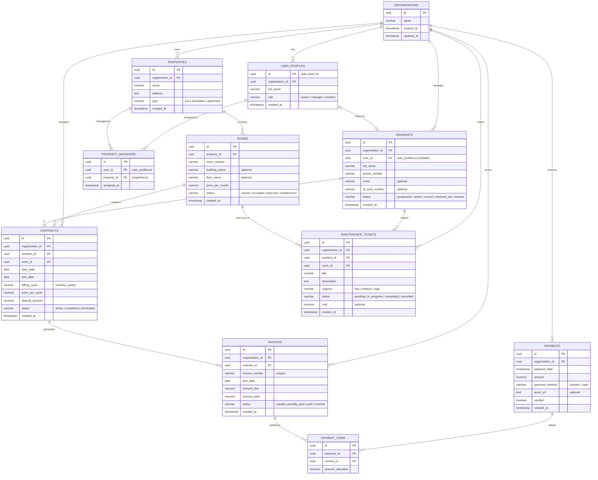

# Entity Relationship Diagram (ERD)
## Kos Management System (KMS)

Berikut adalah diagram hubungan entitas (ERD) untuk sistem manajemen kos (KMS) yang mendukung multi-tenancy dan tiga peran utama: Pemilik (Owner), Pengelola (Manager), dan Penghuni (Resident).

---

## Deskripsi Relasi Tambahan (Role Penghuni)

1. **Link Akun Penghuni (`user_profiles` <-> `residents`)**:
   - Kolom `user_id` di tabel `residents` bersifat nullable. Ketika penghuni mendaftar di portal aplikasi, akun penggunanya (`user_profiles` dengan role `resident`) dihubungkan ke record data `residents` yang sudah diinput oleh Manager. Ini mengamankan agar penghuni hanya dapat melihat data sewa mereka sendiri.
2. **Tiket Pemeliharaan (`maintenance_tickets`)**:
   - Menghubungkan langsung `residents` (pelapor) dan `rooms` (lokasi kerusakan) agar mempermudah pengelola melacak di kamar mana perbaikan harus dilakukan dan siapa yang harus dihubungi.
   - Biaya perbaikan (`cost`) bersifat opsional, dapat diinput oleh pengelola untuk diakumulasikan sebagai pengeluaran properti.
